# XT-Bot 🤖

爬取Twitter推文和媒体,支持主页时间线/用户推文,通过Telegram Bot推送媒体内容

## 功能特性 🚀

- 定时同步Twitter主页时间线推文(30分钟/次)
- 同步指定用户全量历史推文及媒体(支持多用户)
- Telegram Bot自动推送图文/视频(支持格式限制：图片<10M,视频<50M)
- 实现数据分离,数据存储在 `XT-Data` 项目(推文数据/推送记录)
- GitHub Actions 自动化部署
- Twitter广播/空间链接同步到Telegram(飞书可选)
- 操作异常告警信息添加飞书机器人消息通知(可选)
- 运行日志加密存储(可选)

## 快速配置 ⚙️

1.Fork [XT-Bot](https://github.com/iniwym/XT-Bot) 项目

2.创建私有[仓库](https://github.com/new) `XT-Data` 用于保存配置、推文和推送数据

3.在 `XT-Data` 项目添加配置文件,或进行数据迁移

将 `config/config.json` 配置文件提交到 `XT-Data` 项目根目录

`XT-Data` 项目目录结构如下：

```
└── config/
     └── config.json
```

`config.json` 配置项如下,根据需求进行自定义

| 参数名              | 说明                                                                   | 
|---------------------|----------------------------------------------------------------------|
| `consoleLogLevel`   | 控制台日志级别(默认INFO)(可选项：DEBUG、INFO、WARN、ERROR)                | 
| `interval`          | 请求间隔(默认5000ms)                                                   | 
| `filterRetweets`    | 是否过滤转发推文(默认true过滤)                                           | 
| `filterQuotes`      | 是否过滤引用推文(默认true过滤)                                           | 
| `limit`             | 同步指定用户推文数量(默认不限制)                                          | 
| `screenName`        | 要同步的Twitter用户列表(同步@xxx时填`"xxx"`,无需@符号)                    | 

`config.json` 样例：

```josn
{
  "consoleLogLevel": "INFO",
  "interval": 5000,
  "filterRetweets": true,
  "filterQuotes": false,
  "limit": 2000,
  "screenName": [
    "xxx"
  ]
}
```

<details>
<summary>数据迁移(首次部署忽略)</summary>

将历史数据中以下文件夹迁移到 `XT-Data` 项目根目录下：

```
Python/dataBase
Python/output
TypeScript/tweets
```

迁移后的 `XT-Data` 项目目录结构如下：

```
├── config/
│   └── config.json
├── Python/
│   └── dataBase/
│   └── output/
└── TypeScript/
    └── tweets/
```

</details>

4.在 `XT-Bot` 项目中添加Secrets配置项

在仓库 Settings → Secrets → Actions → Repository secrets 中添加：

| Secret Key       | 获取方式                                                                 |
|------------------|------------------------------------------------------------------------|
| `ARTIFACT_PASS`  | (可选)日志加密密码,留空则不生成Artifact                                     |
| `AUTH_TOKEN`     | 浏览器访问 [Twitter](https://x.com) 查看控制台Cookies中的 `auth_token`     |
| `BOT_TOKEN`      | 通过 [@BotFather](https://t.me/BotFather) 创建Telegram Bot获取TOKEN,常用指令 `/start` `/newbot` `/mybots` |
| `CHAT_ID`        | 通过 [@userinfobot](https://t.me/userinfobot) 获取用户ID,常用指令 `/start` |
| `GH_TOKEN`       | 创建 [GitHub Token](https://github.com/settings/tokens/new) (No Expiration和scopes全选) |
| `LARK_KEY`       | (可选)飞书群聊机器人Webhook地址最后段`xxxxxxxx`                              |
| `REDIS_CONFIG`   | (可选)Redis连接配置(JSON格式),可动态修改 `XT-Data/config/config.json` 配置文件 |
| `SCREEN_NAME`    | 你的Twitter用户名(不含@),用于获取关注列表                                    |

REDIS_CONFIG 格式如下：

```json
{
  "host": "your.redis.host",
  "port": 6379,
  "password": "your_password",
  "db": 0
}
```

<details>
<summary>Secret配置图片参考</summary>

- `XT-Bot` 项目的Secrets配置项

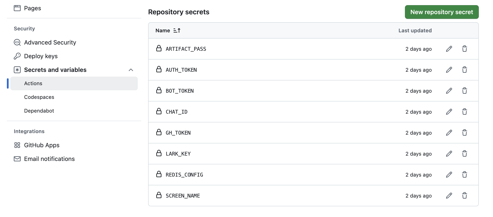

- 添加ARTIFACT_PASS后生成的加密Artifact文件

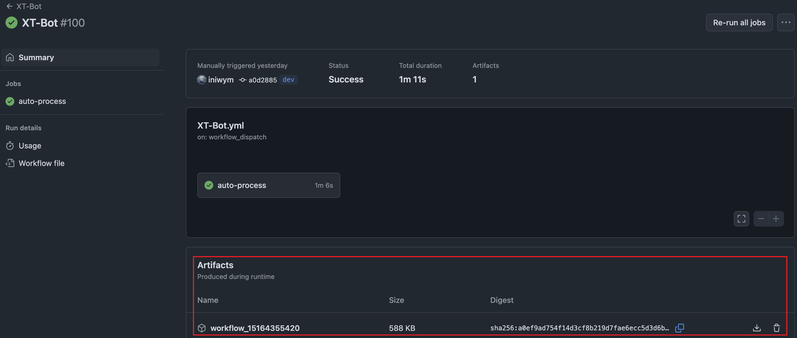

- 浏览器访问Twitter在控制台查看Cookies的auth_token

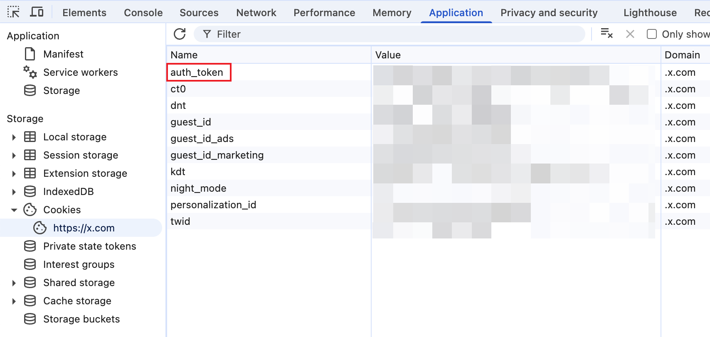

- 生成GitHub Token

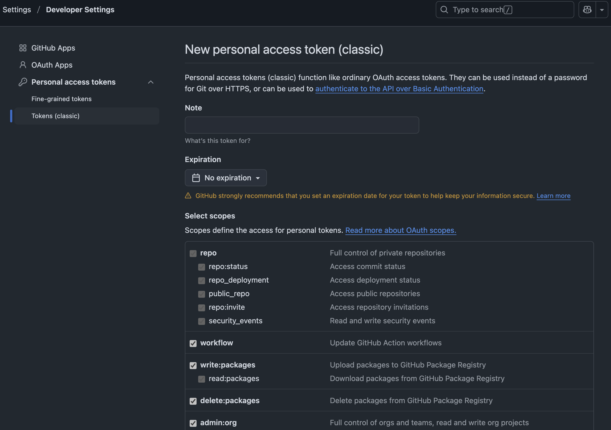

- 飞书机器人Webhook地址LARK_KEY

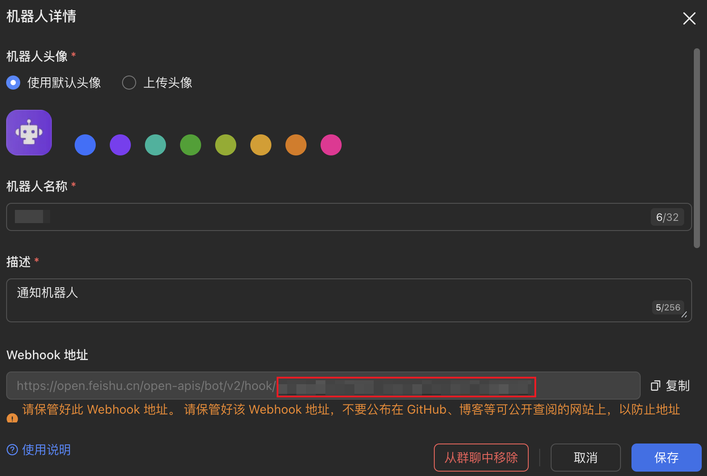

- 免费的Redis数据库

1. 访问 [redislabs](https://app.redislabs.com/)  注册账号
2. 创建免费数据库(30M存储空间)

域名和端口信息

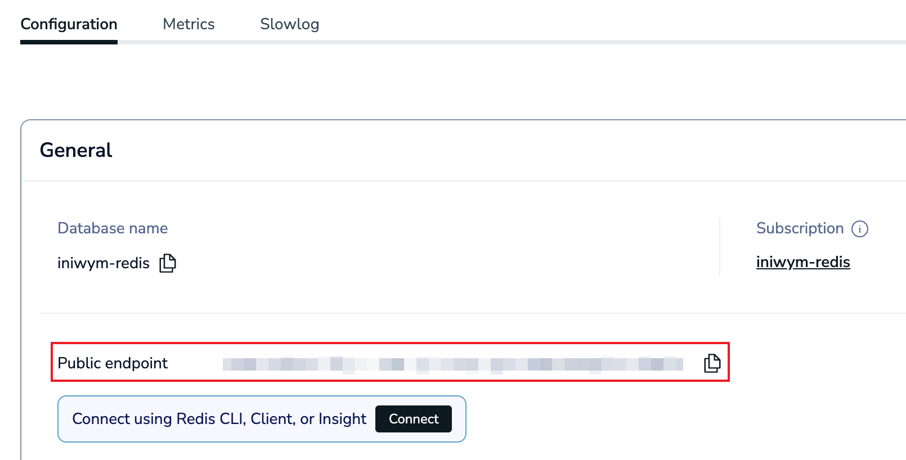

密码信息

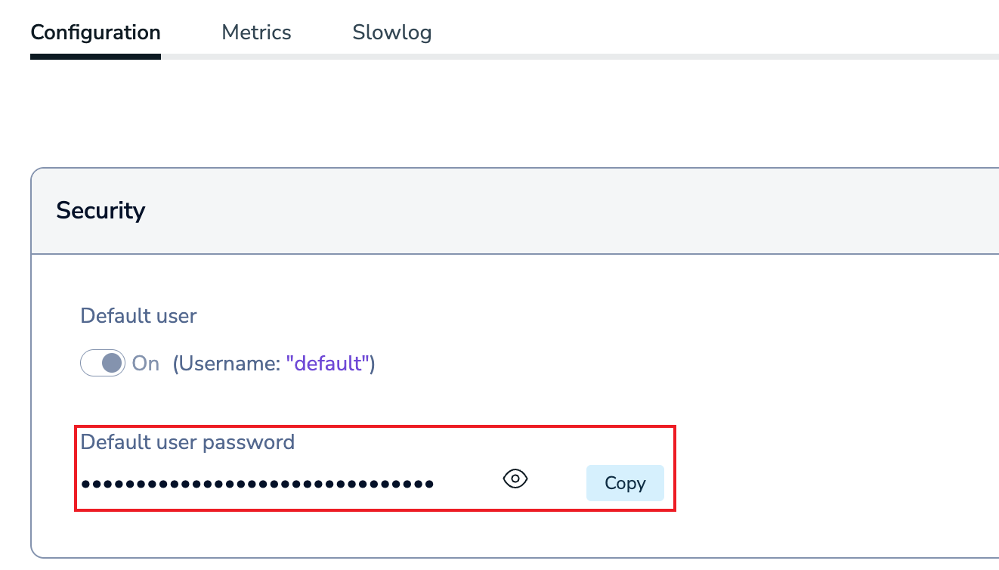

</details>

## `XT-Bot` 流程使用说明 ⚡

### 自动同步流程 [`XT-Bot.yml`]

- 🕒 每30分钟自动执行
- 同步最近24小时的主页时间线推文
- 过滤广告等非关注用户推文
- 支持相关参数配置 `XT-Data/config/config.json`
- 自动推送图片和视频到Telegram Bot

为了实现自动执行,需要从下面的两种定时方式中选择一种

> 方式一: 使用Github Action的 Schedule

无需额外的配置,但运行时间可能会存在延迟

修改 `XT-Bot/.github/workflows/XT-Bot.yml` 文件中的下面内容

```yaml
name: XT-Bot

on:
  workflow_dispatch:      # 允许手动触发
  schedule:
    - cron: '*/30 * * * *'  # 每30分钟运行
```

> 方式二: 使用[Cloudflare](https://www.cloudflare.com/) Worker(推荐)

由于Github Action的Schedule在高峰期有运行不准时的问题,推荐使用Cloudflare Worker来定时执行

1.创建Worker任务,代码参考 `TypeScript/utils/cloudflare-trigger.js`

2.参数配置 Settings > Variables and Secrets

```
- GITHUB_TOKEN  # GitHub API Token
- GITHUB_USER   # GitHub用户名
- REPO_NAME     # GitHub仓库名
- WORKFLOW_NAME # Github Action名称(XT-Bot.yml)
```

3.定时配置 Settings > Trigger Events

自定义Cron表达式,例如 `# 20,50 * * * *`

<details>
<summary>定时检查GitHub Action运行状态(可选)</summary>

cloudflare-trigger配置

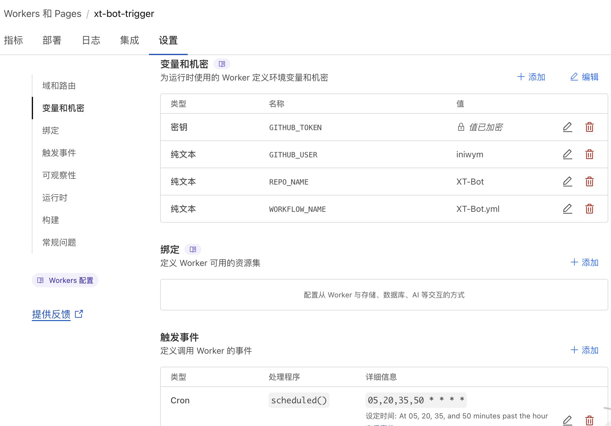

定时检查GitHub Action运行状态,失败发送飞书机器人通知

1.创建Worker任务,代码参考 `TypeScript/utils/cloudflare-check.js`

2.参数配置 Settings > Variables and Secrets

```
- GITHUB_TOKEN  # GitHub API Token
- GITHUB_USER   # GitHub用户名
- REPO_NAME     # GitHub仓库名
- WORKFLOW_NAME # Github Action名称(XT-Bot.yml)
- LARK_KEY      # 飞书机器人key
```

3.定时配置 Settings > Trigger Events

自定义Cron表达式,例如 `# 20,50 * * * *`

cloudflare-check配置

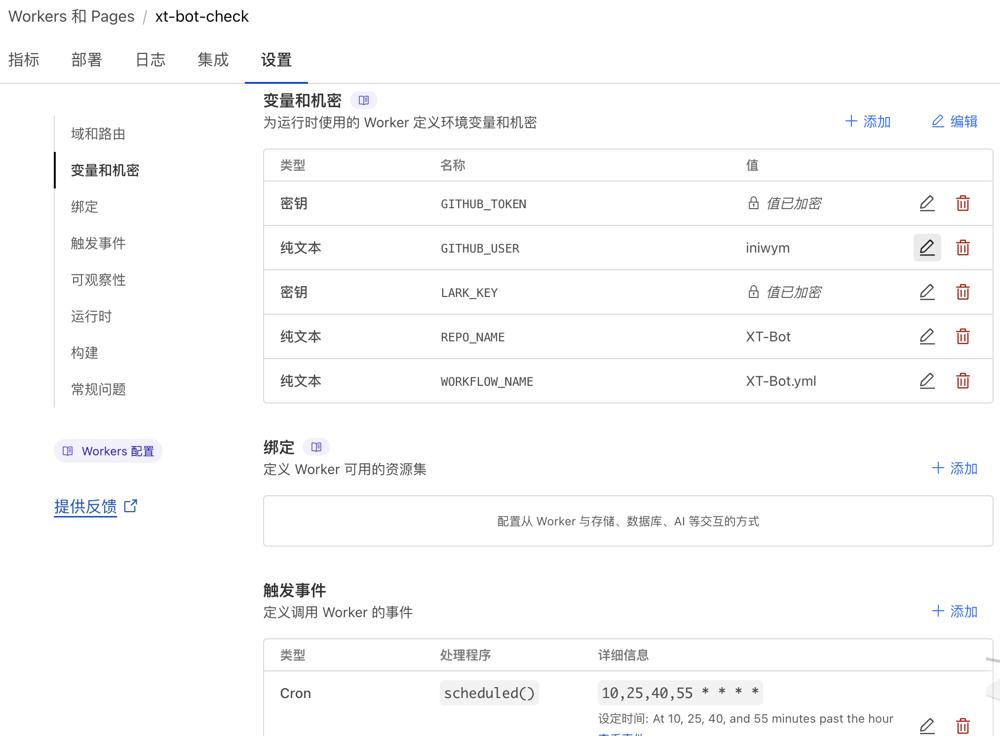

</details>

### 手动初始化流程 [`INI-XT-Bot.yml`]

- 同步指定用户全量推文
- 支持多用户
- 支持相关参数配置 `XT-Data/config/config.json`
- 自动推送图片和视频到Telegram Bot

设置用户列表方式有两种

> 方式一: 手动修改 `XT-Data/config/config.json` 配置文件中的 `screenName` 列表

同步@aaa和@bbb时的配置如下,其他参数自行配置

```json
{
  "consoleLogLevel": "INFO",
  "interval": 5000,
  "filterRetweets": true,
  "filterQuotes": false,
  "limit": 2000,
  "screenName": [
    "aaa",
    "bbb"
  ]
}
```

> 方式二: 通过Redis来指定用户列表(推荐)

Redis的key键 `config` 内容对应 `XT-Data/config/config.json`

动态修改配置文件,无需提交代码

<details>
<summary>Redis配置效果预览</summary>

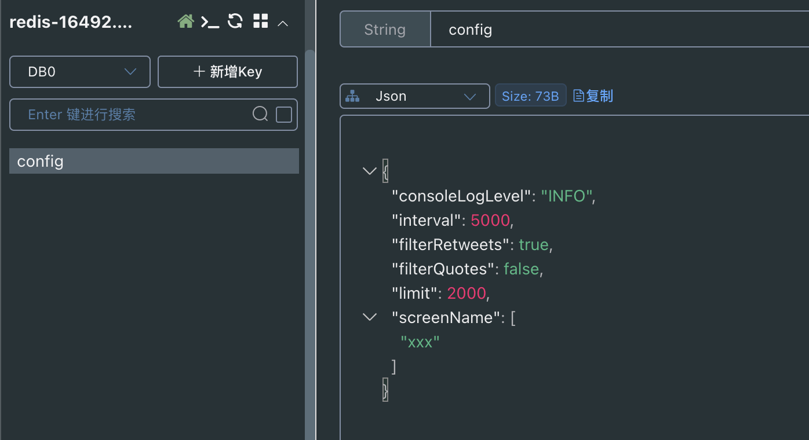

</details>

⚠️ **注意事项**

- 由于Twitter API请求限制,同步指定用户全量推文流程可能存在失败情况,请勿频繁执行,请勿指定大量用户
- 在同步指定用户全量推文流程前,请先在Actions面板停用 `XT-Bot.yml` ,避免代码提交时版本冲突而失败
- 或者使用 `XT-Bot/sh/INI-XT-Bot.sh` 脚本执行相关流程操作,使用前需修改 `REPO="your_username/XT-Bot"`

<details>
<summary>INI-XT-Bot.sh功能说明</summary>

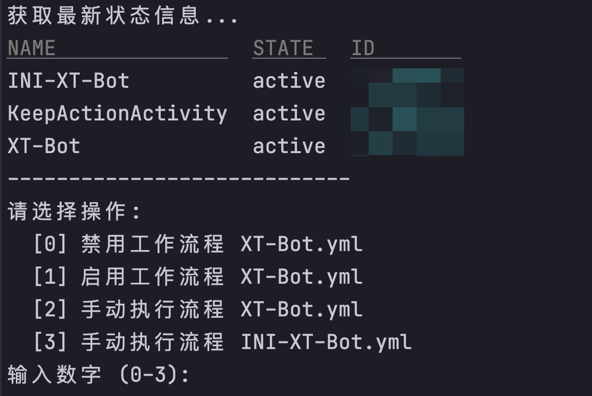

</details>

## 技术参考 📚

- https://github.com/xiaoxiunique/x-kit
- https://github.com/fa0311/twitter-openapi-typescript

## 开源协议 📜

本项目基于 MIT License 开源

## 交流群 ✉️

https://t.me/+SYZQ5CO4oLE3ZjI1